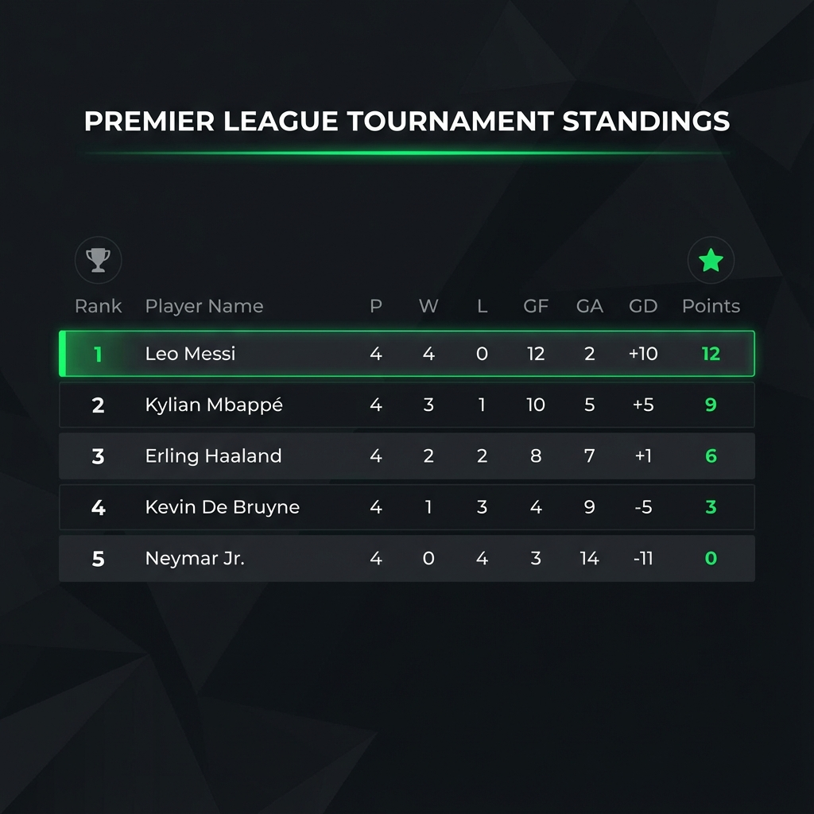

# Architettura Sistema di Classifica Torneo Calcio

Documento di progettazione tecnica per la gestione automatizzata del torneo "Lega all'Italiana" (5 giocatori).

## 1. Schema Dati

I dati saranno memorizzati in file JSON semplici per facilitare la modifica manuale e la lettura da parte degli script.

### `matches.json`
Contiene lo storico delle partite. È il "source of truth".
```json
[
  {
    "id": 1,
    "home_player": "Marco",
    "away_player": "Luca",
    "home_score": 2,
    "away_score": 2,
    "penalties_winner": "Marco", 
    "played": true
  },
  {
    "id": 2,
    "home_player": "Giovanni",
    "away_player": "Matteo",
    "home_score": 1,
    "away_score": 0,
    "penalties_winner": null,
    "played": true
  }
]
```
*Nota: `penalties_winner` è opzionale (null) se la partita non finisce in parità.*

### `standings.json` (Generato)
Output calcolato dallo script, usato dal frontend per la visualizzazione.
```json
[
  {
    "rank": 1,
    "player": "Marco",
    "points": 8,
    "played": 4,
    "wins_90": 2,
    "wins_pen": 1,
    "loss_pen": 0,
    "loss_90": 1,
    "gf": 10,
    "ga": 5,
    "gd": 5
  },
  ...
]
```

## 2. Algoritmo di Calcolo & Tiebreaker

Il calcolo della classifica segue queste regole di punteggio:
- **Vittoria 90'**: 3 punti
- **Vittoria Rigori**: 2 punti
- **Sconfitta Rigori**: 1 punto
- **Sconfitta 90'**: 0 punti

### Pseudocodice Risoluzione Parità (Tiebreaker)

L'ordine di classamento è:
1. Punti Totali
2. Punti negli Scontri Diretti (Classifica avulsa tra i pari merito)
3. Differenza Reti Totale
4. Gol Fatti Totali

```python
def sort_standings(teams):
    # Funzione di comparazione custom
    def compare(team_a, team_b):
        # 1. Punti Totali
        if team_a.points != team_b.points:
            return team_b.points - team_a.points
        
        # 2. Scontri Diretti (H2H)
        h2h_points_a = get_h2h_points(team_a, team_b)
        h2h_points_b = get_h2h_points(team_b, team_a)
        if h2h_points_a != h2h_points_b:
            return h2h_points_b - h2h_points_a
            
        # 3. Differenza Reti
        if team_a.gd != team_b.gd:
            return team_b.gd - team_a.gd
            
        # 4. Gol Fatti
        return team_b.gf - team_a.gf

    return sorted(teams, key=cmp_to_key(compare))
```

*Nota: Per gli scontri diretti con >2 squadre a pari merito, si calcola una "mini-classifica" considerando solo le partite tra le squadre coinvolte.*

## 3. Tech Stack

Scegliamo uno stack **JAMstack** (JavaScript, APIs, Markup) senza backend attivo per massimizzare semplicità e zero costi di hosting.

| Componente | Tecnologia | Motivazione |
|------------|------------|-------------|
| **Frontend** | HTML5 + Vanilla JS + CSS (Tailwind opz.) | Leggero, veloce, nessun framework complesso necessario per una tabella. |
| **Logic** | Python | Eccellente per manipolazione dati e logica tiebreaker complessa. |
| **Data** | JSON | Leggibile, versionabile con Git. |
| **Automation** | GitHub Actions | Esegue lo script Python ad ogni push. |
| **Hosting** | GitHub Pages | Hosting statico gratuito e integrato. |

## 4. Automazione GitHub

Il sistema si aggiorna automaticamente quando un amministratore modifica i risultati.

### Diagramma di Flusso (ASCII)

```ascii
[Admin PC]              [GitHub Cloud]                 [User Browser]
    |                         |                              |
    | Modifica matches.json   |                              |
    | & git push origin main  |                              |
    +------------------------>|                              |
                              | 1. Trigger Action (Push)     |
                              |                              |
                              | 2. Setup Python Env          |
                              |                              |
                              | 3. Run script.py             |
                              |    (Read matches.json)       |
                              |    (Calc Standings)          |
                              |    (Write standings.json)    |
                              |                              |
                              | 4. Commit & Push (Bot)       |
                              |    (Update repo)             |
                              |                              |
                              | 5. Deploy to Pages           |
                              +----------------------------->| Refreshes Page
                                                             | (Shows new Data)
```

### Configurazione Workflow (`.github/workflows/update_rankings.yml`)
- **Trigger**: Push su path `data/**`
- **Permissions**: `contents: write` (per committare la classifica aggiornata)

## 5. Mockup Visuale

Esempio di come apparirà la classifica finale generata.



## 6. Flusso Operativo Modifica Risultato

1.  Aprire il file `matches.json` (da interfaccia web GitHub o editor locale).
2.  Trovare il match ID corrispondente.
3.  Inserire i punteggi (`home_score`, `away_score`) e settare `played: true`.
4.  Se pareggio, indicare il vincitore rigori in `penalties_winner`.
5.  Salvare (Commit).
6.  **Attendere ~30 secondi**: La classifica online si aggiornerà da sola.
